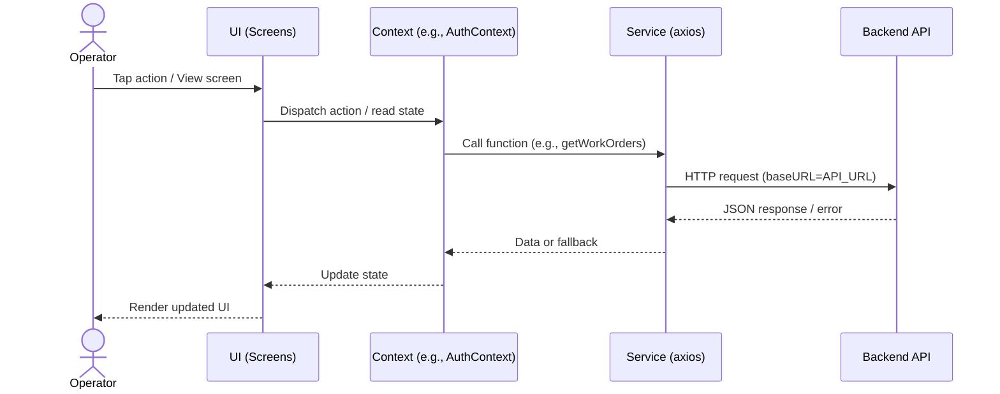

# Architecture — Factory Operator App

## 1) System Overview
A React Native (Expo) mobile app with a simple layered architecture:
- UI: screens and reusable components.
- State: React Contexts for auth, language, and theme.
- Services: API interaction via axios, centralized endpoints.
- Utilities: small helpers (e.g., network checks, notifications).

## 2) High-Level Modules
- `src/screens/` — Feature screens, e.g., `dashboard/DashboardScreen.js`.
- `src/components/` — Reusable UI pieces.
- `src/contexts/` — Global state providers (e.g., `AuthContext.js`).
- `src/services/` — API calls (e.g., `workOrderService.js`).
- `src/constants/api.js` — `API_URL`, `API_ENDPOINTS`, `REQUEST_TIMEOUT`, `RETRY_CONFIG`.
- `src/localization/translations.js` — i18n strings.

## 3) Data & Control Flow

## 4) Authentication & Security
- Context: `src/contexts/AuthContext.js` manages auth state.
- Storage:
  - Token in `expo-secure-store` (`factory_app_token`).
  - Remember-me + timestamps in AsyncStorage.
- Session:
  - Inactivity auto-lock (30 min) if not remembered.
  - Optional Phone OTP → PIN flow for quick unlock (OTP via local notification).
  - Dev bypass credentials: `Operator1` / `123` create a mock token for development.

## 5) Networking
- Axios instance per service with `baseURL = API_URL` from `src/constants/api.js`.
- Endpoints centralized in `API_ENDPOINTS` to avoid string duplication.
- Timeouts: `REQUEST_TIMEOUT` constant (30s).
- Retry config: `RETRY_CONFIG` defined but not globally wired to axios by default.
- Multipart upload example: `reportWorkOrderIssue()` in `workOrderService.js` uses `FormData` and sets `Content-Type: multipart/form-data`.

## 6) Offline & Fallback Behavior
- Work Orders: on API error, returns dummy list (`workOrderService.js`).
- Notifications: API routes exist, current implementation may use AsyncStorage locally.
- Breakdown: docs note custom timeouts and offline-friendly stubs.
  - See `docs/API_ROUTES.md` → Implementation Notes.

## 7) Localization
- i18n via `i18n-js` with `expo-localization`.
- Translation keys in `src/localization/translations.js`.

## 8) Navigation
- React Navigation v7 (bottom-tabs, native-stack, stack).
- Keep screens presentational; move side-effects to contexts/services.

## 9) Error Handling
- Try/catch around async calls in services/contexts.
- User-facing alerts for failures (e.g., login errors).
- Console logging for development.

## 10) Security Considerations
- Store auth token in secure storage.
- Avoid logging sensitive data.
- Enforce inactivity lock; optional PIN unlock.
- Future: API token refresh/rotation; server-driven notifications; role-based access.

## 11) Performance & NFRs
- Target responsive UI; minimize unnecessary re-renders (memoize heavy components).
- Network timeouts (30–60s) and graceful degradation.
- Light theme; reasonable bundle size via Expo-managed workflow.

## 12) Future Improvements
- Wire `RETRY_CONFIG` with axios interceptors (or integrate `axios-retry`).
- Centralize a shared axios instance with interceptors for auth headers and retries.
- Add caching and offline sync for critical lists (e.g., work orders).
- Introduce global error/toast handler.
- Add tests (Jest + RNTL), linting, CI/CD (EAS Build for releases).

## 13) References
- API routes and notes: `docs/API_ROUTES.md`
- Constants: `src/constants/api.js`
- Auth flow: `src/contexts/AuthContext.js`
- Work orders service: `src/services/workOrderService.js`
